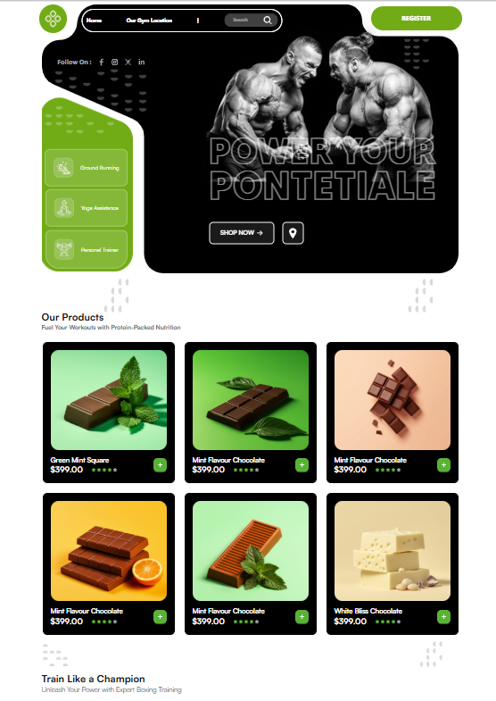
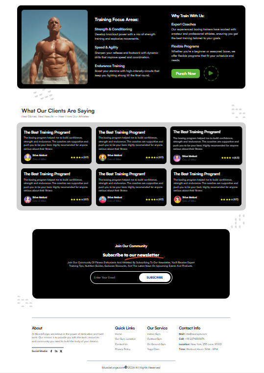
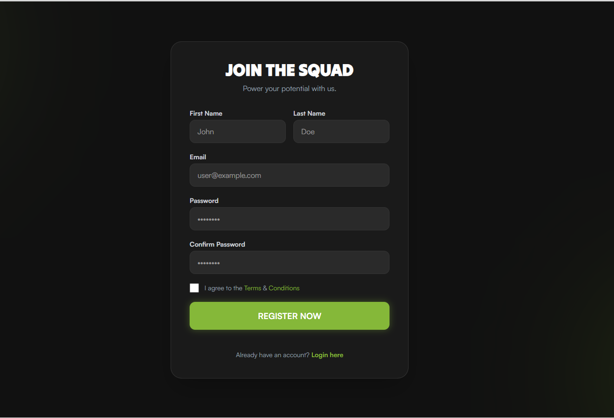
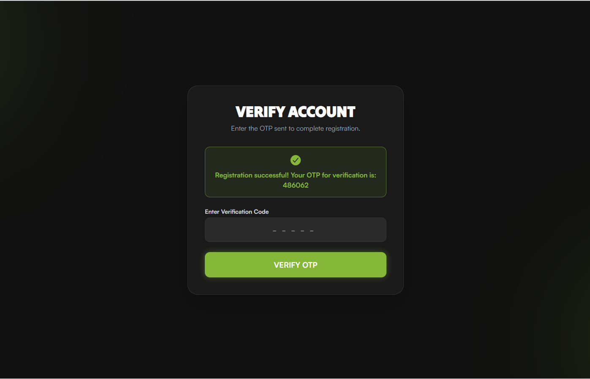
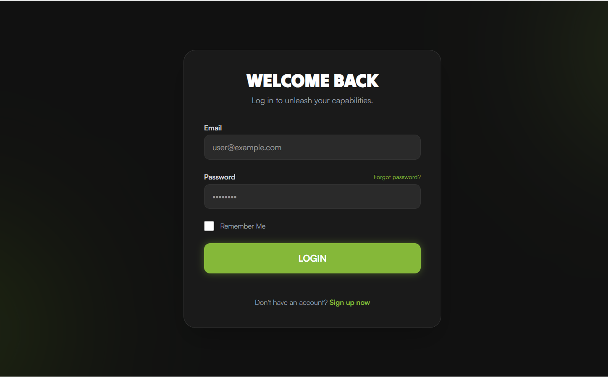

# 🏋️ Gymnastic Web App

A sleek, visually-focused React web application built for fitness enthusiasts. Featuring premium dark-mode aesthetic styling, comprehensive authentication flows, and dynamic, interactive layouts to showcase gym services and nutrition products.

## 🚀 Features

- **Responsive Landing Page:** Dynamic, responsive, and beautifully arranged landing sections including banners, training programs, client reviews, and custom products.
- **Full Authentication Flow:**
  - Secure Registration with standard form properties.
  - Multi-step OTP Verification baked directly into the onboarding loop.
  - Secure Login routing dynamically verified against API responses.
- **Premium Frontend Aesthetics:** Incorporates fluid CSS transitions, layered blurred backdrop glassmorphism, and bold typography.
- **Clean Architecture:** Abstracted network handling managing backend data interactions effortlessly via Axios.

## 🛠️ Tools & Packages Used

This project was built leveraging the latest ecosystem combinations:

- **Frontend Core:** [React 19](https://react.dev/) + [Vite](https://vitejs.dev/)
- **Styling System:** [Tailwind CSS v4](https://tailwindcss.com/) & [DaisyUI](https://daisyui.com/)
- **Routing Engine:** [React Router v7](https://reactrouter.com/)
- **Network Requests:** [Axios](https://axios-http.com/)
- **Iconography:** [React Icons](https://react-icons.github.io/react-icons/) 
- **Typhography:** [Tilt Wrap](https://fonts.google.com/specimen/Tilt+Warp?preview.script=Latn) And [Satoshi](https://www.fontshare.com/?q=Satoshi)

## ⚙️ Project Setup Instructions

Follow these steps to get your local development environment up and running!

1. **Clone the repository**
   ```bash
   git clone <repository-url>
   cd gymnastic
   ```

2. **Install dependencies**
   Install all necessary packages via npm.
   ```bash
   npm install
   ```

3. **Environment Setup**
   Make sure you specify your API source. Create a `.env` file in the root directory and add this API base URL:
   ```env
   VITE_API_BASE_URL="https://apitest.thewarriors.team/api"
   ```

4. **Run the Development Server**
   ```bash
   npm run dev
   ```
   Open your browser to the local URL (usually `http://localhost:5173`) to view and interact with the application.

## 📸 Screenshots


### Landing Page
> The main Landing Page and feature sets displaying the gym's capabilities and shop items.




### Registration Flow
> Secure onboarding form matching the high-end sports aesthetic.



### Account Verification (OTP)
> Secure verification gateway triggered seamlessly post-registration.



### Login Interface
> Secure return entry point directly to the platform.


